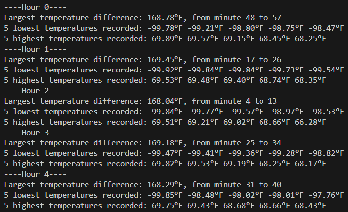

# Instructions
1. Clone the repo with `git pull https://github.com/NicholasR32/MinotaurMindgames`. 
    - Alternatively, simply download `Problem1.java` and `Problem2.java`.
2. Run each program with `java Problem1.java`, etc.
3. Results should appear in your terminal.

Example output for each problem can be seen in `Problem1out.txt` and `Problem2out.txt` respectively.
# Problem 1: Minotaur's Birthday Presents
A method called `work` manages actions such as removing from the bag of unordered presents, represented as a stack, and adding to the chain of ordered presents, represented as a `CLLnode`, an implementation of a concurrent linked list. While the bag or the chain still have presents, a `Servant` thread is assigned to either:
1. Pop the next present from the bag and add it to the appropriate place within the sorted chain of presents.
2. Remove the head of the chain of presents and write a thank-you card to that present's recipient.

# Problem 2: Atmospheric Temperature Reading Module
The main thread acts as the temperature reading module that manages the 8 temperature sensors on the rover. Each Thread is an instance of the `Sensor` class, which has a shared static array `sensorReadings` with slots for readings from each of the sensors. When a thread is run, it generates a random double in [-100,70], then calls synchronized method `storeReading`, which ensures mutual exclusion on the shared array.

Hours and minutes are simulated with nested for loops. Each "minute", 8 new `Sensor` threads are created, ran in order to get and store a temperature reading, and then joined to ensure complete execution. Once the `sensorReadings` array is filled, it is copied to a row in the 2D array `allReadings`, which stores readings from every sensor for every minute.

After every hour, `allReadings` is processed to find the 5 lowest readings, 5 highest readings, and the 10-minute interval of largest temp difference.

Trial runs of the atmospheric temperature reading module tend to almost always yield lowest temperatures near -100, highest temperatures near 70, and a max temperature difference of near 170 over any 10-minute interval. This is expected, since every hour 480 readings are taken, with a range of only 170 possible degrees Fahrenheit.

